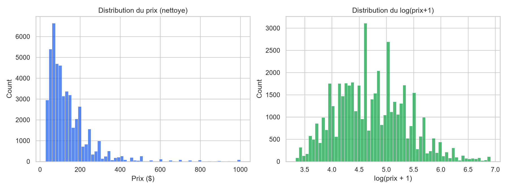
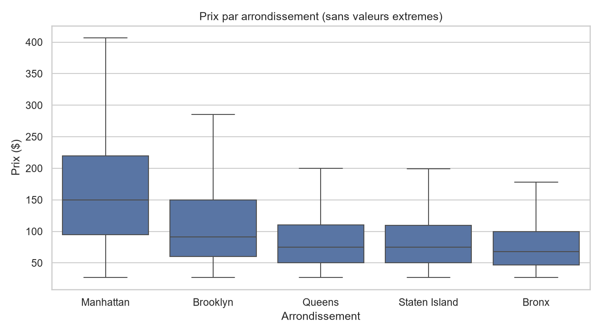
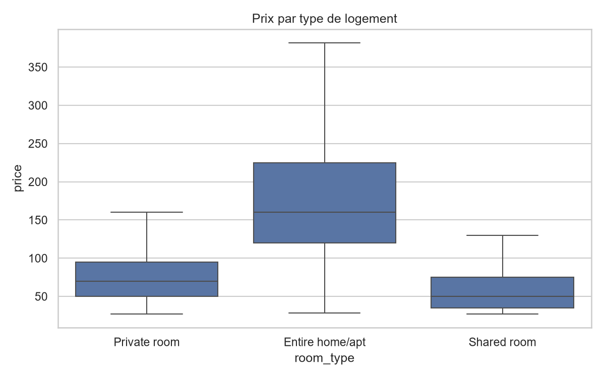
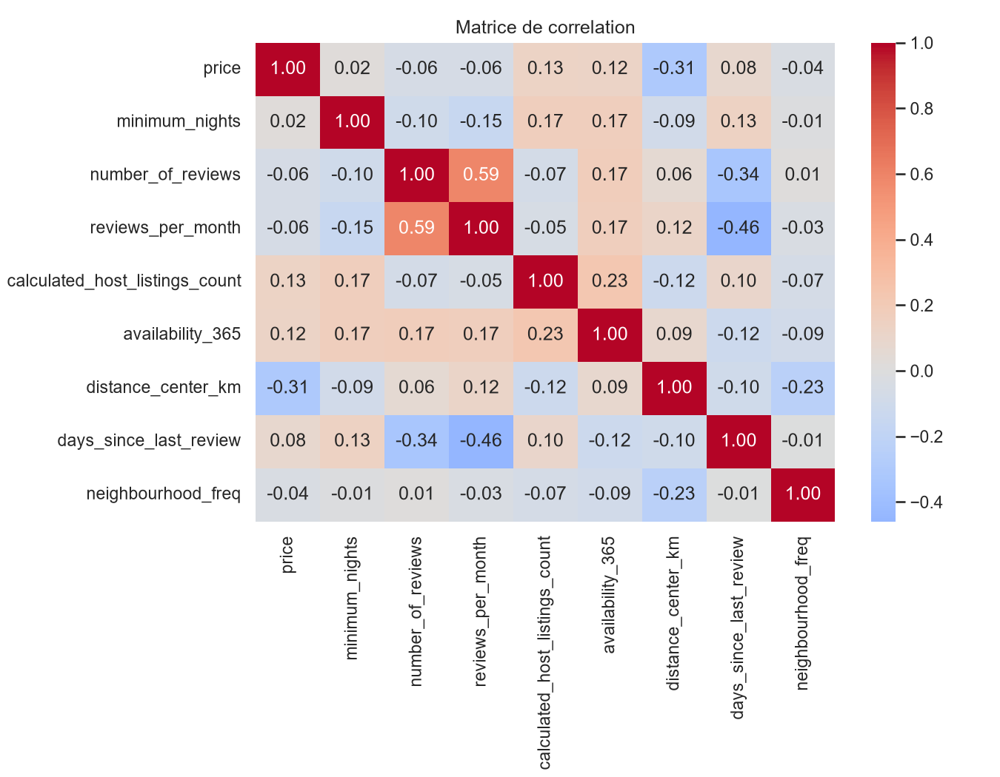
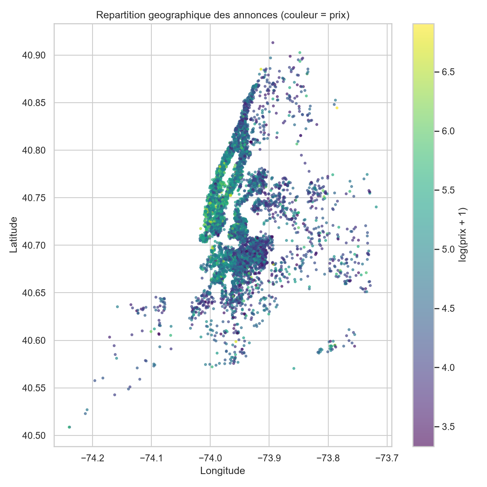
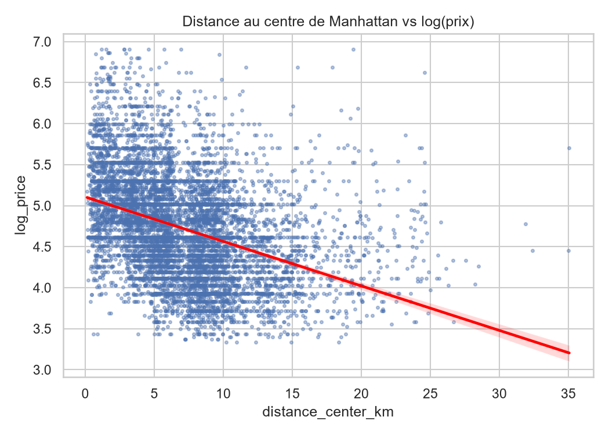
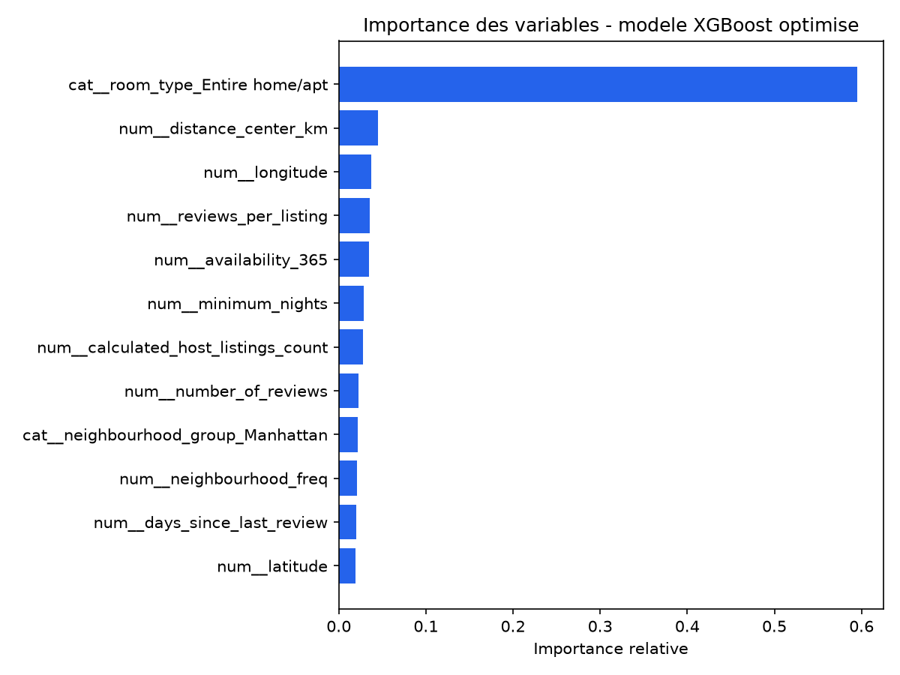
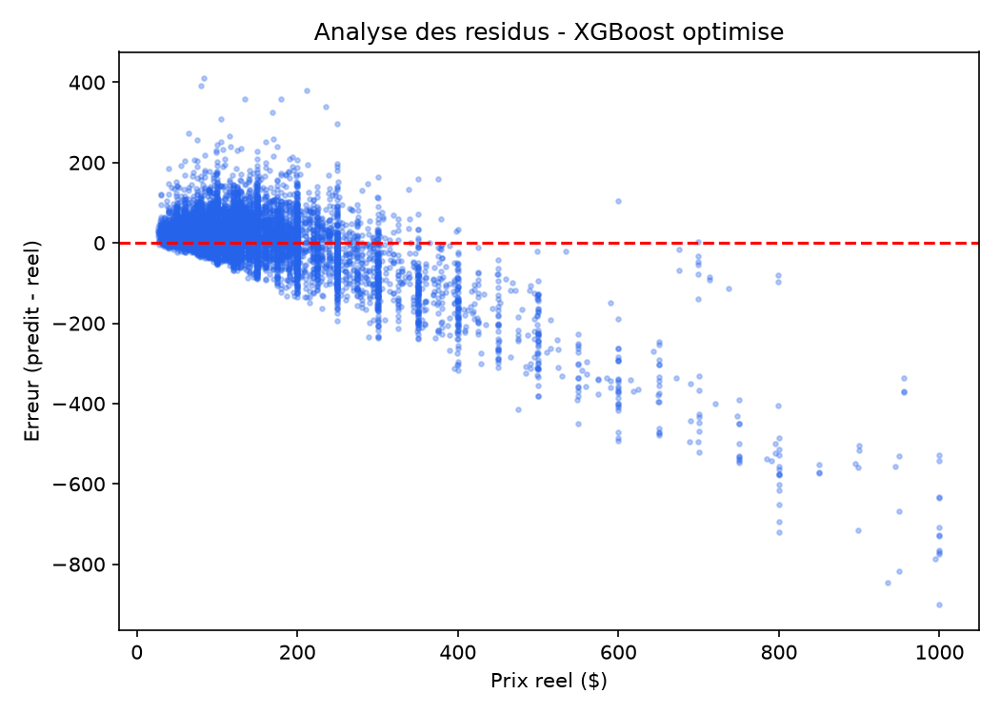

```{=openxml}
<w:p><w:pPr><w:jc w:val="center"/><w:spacing w:before="600"/></w:pPr>
<w:r><w:rPr><w:sz w:val="24"/></w:rPr><w:t>Dépôt GitHub du projet :</w:t></w:r>
</w:p>
<w:p><w:pPr><w:jc w:val="center"/></w:pPr>
<w:r><w:rPr><w:sz w:val="24"/><w:color w:val="2563EB"/></w:rPr>
<w:t>https://github.com/kasdiines/airbnb-nyc-price-prediction</w:t></w:r>
</w:p>
<w:p><w:r><w:br w:type="page"/></w:r></w:p>
```

## Table des matières

**1. Introduction**

- 1.1 Contexte
- 1.2 Problématique
- 1.3 Objectifs
- 1.4 Contributions
- 1.5 Structure du rapport

**2. Veille scientifique et technique**

- 2.1 Revue de littérature
- 2.2 Benchmark des solutions existantes
- 2.3 Technologies retenues — argumentation des choix

**3. Méthodologie de résolution**

- 3.1 Analyse des besoins
- 3.2 Conception
- 3.3 Développement de la solution
- 3.4 Résultats obtenus et analyses

**4. Conclusion et perspectives**

- 4.1 Bilan global du projet
- 4.2 Retour sur les objectifs atteints
- 4.3 Difficultés surmontées
- 4.4 Perspectives futures

**5. Bibliographie**

**6. Annexes**

- Annexe A — Environnement technique
- Annexe B — Extrait du pipeline de prétraitement
- Annexe C — Extrait de la comparaison de modèles
- Annexe D — Structure de l'interface graphique
- Annexe E — Glossaire

```{=openxml}
<w:p><w:r><w:br w:type="page"/></w:r></w:p>
```

# 1. Introduction

## 1.1 Contexte

La plateforme Airbnb a profondément transformé le marché de la location de courte
durée depuis sa création en 2008. Rien que sur la ville de New York, on recense
chaque année plusieurs dizaines de milliers d'annonces actives, réparties sur les
cinq arrondissements (Manhattan, Brooklyn, Queens, Bronx, Staten Island), avec des
prix qui varient considérablement selon la localisation, le type de bien, la
popularité de l'hôte ou encore la saisonnalité. Cette variabilité rend la fixation
d'un prix pertinent difficile aussi bien pour un nouvel hôte souhaitant mettre en
ligne son logement que pour un voyageur cherchant à évaluer si le tarif proposé est
cohérent avec le marché local.

Ce projet s'inscrit dans le cadre d'un travail personnel encadré (TER / projet fil
rouge) portant sur l'application de techniques de Machine Learning à un problème
concret de prédiction de prix. Il mobilise l'ensemble de la chaîne de traitement
d'un projet de data science : depuis la collecte et le nettoyage des données brutes
jusqu'au déploiement d'une interface graphique interactive, en passant par
l'analyse exploratoire, la modélisation et l'évaluation comparative de plusieurs
algorithmes d'apprentissage supervisé.

Le jeu de données utilisé, *New York City Airbnb Open Data*, disponible sur Kaggle,
regroupe environ 49 000 annonces actives à New York en 2019, avec 16 variables
décrivant chaque logement (localisation géographique, type de chambre, prix,
nombre d'avis, disponibilité annuelle, etc.).

## 1.2 Problématique

La question centrale de ce projet peut se formuler ainsi : **dans quelle mesure
est-il possible de prédire, avec une précision satisfaisante, le prix par nuit
d'une annonce Airbnb à partir de ses seules caractéristiques structurelles et de
sa localisation, sans disposer d'information sur la qualité perçue du logement
(photos, description, avis textuels) ?**

Cette problématique soulève plusieurs défis techniques et scientifiques :

- **Hétérogénéité et bruit des données** : les prix affichés sur Airbnb sont fixés
  librement par les hôtes et ne reflètent pas toujours la valeur "de marché" du
  bien (sous-évaluation volontaire, prix promotionnels, prix aberrants).
- **Cardinalité élevée de certaines variables catégorielles** : la variable
  `neighbourhood` comporte plus de 200 modalités, ce qui pose la question du bon
  encodage à utiliser pour ne pas faire exploser la dimensionnalité du problème.
- **Non-linéarité de la relation prix/caractéristiques** : le prix d'un logement ne
  varie pas linéairement avec la distance au centre-ville ou le nombre d'avis, ce
  qui justifie la comparaison de modèles linéaires et non linéaires.
- **Absence de variables qualitatives fortes** : sans les photos ni la description
  textuelle des annonces, une partie de la variance du prix reste structurellement
  inexpliquée, ce qui impose de fixer des attentes réalistes sur la performance
  atteignable (un R² proche de 1 n'est pas un objectif réaliste sur ce type de
  données).

## 1.3 Objectifs

Les objectifs concrets poursuivis dans ce projet sont les suivants :

1. Réaliser un prétraitement rigoureux du jeu de données (gestion des valeurs
   aberrantes et manquantes, création de nouvelles variables pertinentes,
   encodage des variables catégorielles).
2. Comparer objectivement au moins dix algorithmes de régression, des modèles
   linéaires simples aux méthodes d'ensemble et aux réseaux de neurones.
3. Optimiser les hyperparamètres des modèles les plus prometteurs afin d'en tirer
   la meilleure performance possible.
4. Évaluer les modèles à l'aide d'au moins quatre métriques complémentaires
   (RMSE, MAE, R², MAPE) et d'une validation croisée à 5 plis.
5. Développer une interface graphique interactive permettant l'exploration des
   données, l'entraînement/paramétrage de modèles, et la prédiction en temps réel
   du prix d'un logement avec une visualisation cartographique.

## 1.4 Contributions

Ce projet ne vise pas à proposer une nouvelle méthode de Machine Learning, mais il
apporte une contribution méthodologique et pratique sur plusieurs points :

- Une **comparaison systématique** de douze algorithmes de régression sur un même
  jeu de données, avec un protocole d'évaluation identique (mêmes variables, même
  découpage train/test, même validation croisée), ce qui permet une lecture
  directement comparable des résultats — une démarche rarement menée de façon aussi
  exhaustive dans les tutoriels disponibles en ligne sur ce dataset.
- Un **feature engineering géographique** original (distance haversine au centre
  de Manhattan) qui améliore la capacité des modèles à capturer l'effet de la
  localisation au-delà du simple découpage par arrondissement.
- Une **interface graphique complète** allant au-delà d'un simple notebook,
  permettant à un utilisateur non technique d'expérimenter lui-même différents
  modèles et de visualiser une prédiction sur une carte interactive.

## 1.5 Structure du rapport

Le présent rapport est organisé en quatre parties principales. La section 2
présente une veille scientifique et technique sur les méthodes de prédiction de
prix immobilier et sur les technologies retenues pour ce projet. La section 3
détaille la méthodologie suivie : analyse des besoins, conception, développement
et résultats obtenus. La section 4 dresse un bilan du projet et ouvre sur des
perspectives d'amélioration. Enfin, la section 5 regroupe les références
bibliographiques utilisées.

---

```{=openxml}
<w:p><w:r><w:br w:type="page"/></w:r></w:p>
```

# 2. Veille scientifique et technique

## 2.1 Revue de littérature

### 2.1.1 La prédiction de prix immobilier comme problème de régression

La prédiction de prix (immobilier, location, ou plus généralement de biens) est un
problème classique de régression supervisée, largement étudié dans la littérature
de Machine Learning. Les approches historiques reposaient sur des modèles
économétriques linéaires de type **régression hédonique**, qui décomposent le prix
d'un bien en une somme pondérée de ses caractéristiques (surface, localisation,
équipements). Ces modèles ont l'avantage d'être interprétables (chaque coefficient
s'interprète comme la contribution marginale d'une caractéristique) mais peinent à
capturer les interactions non linéaires entre variables, en particulier les effets
de seuil ou les interactions entre localisation et type de bien.

Avec l'essor du Machine Learning, de nombreux travaux ont montré la supériorité
des méthodes d'ensemble à base d'arbres de décision (Random Forest, Gradient
Boosting) pour ce type de problème, notamment parce qu'elles gèrent nativement les
non-linéarités et les interactions sans nécessiter de spécification manuelle. Les
travaux de Breiman (2001) sur les forêts aléatoires et de Friedman (2001) sur le
gradient boosting constituent les fondements théoriques de ces méthodes. Plus
récemment, l'algorithme **XGBoost** (Chen & Guestrin, 2016) s'est imposé comme une
référence dans les compétitions de Machine Learning appliquées à des données
tabulaires, grâce à sa régularisation intégrée et son efficacité computationnelle.

### 2.1.2 Travaux spécifiques sur les données Airbnb

Le jeu de données *NYC Airbnb Open Data* est l'un des datasets les plus utilisés
sur Kaggle pour l'apprentissage de la data science, ce qui a donné lieu à un grand
nombre d'analyses publiques. Plusieurs constats reviennent de façon récurrente
dans ces travaux :

- La **localisation géographique** (arrondissement, quartier, distance au centre)
  est systématiquement identifiée comme la variable la plus discriminante pour
  expliquer le prix.
- Le **type de logement** (`room_type` : logement entier, chambre privée, chambre
  partagée) explique une part importante de la variance, un logement entier étant
  en moyenne 2 à 3 fois plus cher qu'une chambre privée.
- Les performances rapportées dans la littérature "grand public" (notebooks
  Kaggle) plafonnent généralement autour d'un R² de 0,5 à 0,65 sans les variables
  textuelles, ce qui confirme l'existence d'une limite structurelle liée à
  l'information manquante (qualité perçue, photos, description).
- Les modèles à base d'arbres (Random Forest, Gradient Boosting, XGBoost)
  surpassent presque systématiquement les modèles linéaires sur ce jeu de données,
  ce qui est cohérent avec la nature fortement non linéaire de la relation entre
  localisation et prix.

### 2.1.3 Techniques et outils existants : avantages et inconvénients

| Technique | Avantages | Inconvénients |
|---|---|---|
| Régression linéaire / Ridge / Lasso | Simple, rapide, interprétable, bonne baseline | Ne capture pas les non-linéarités ni les interactions ; sensible à la colinéarité |
| K-Nearest Neighbors | Non paramétrique, capture les non-linéarités locales | Coûteux en mémoire/temps sur de gros volumes ; sensible à la mise à l'échelle et au fléau de la dimension |
| Arbre de décision | Interprétable, gère nativement variables catégorielles et numériques | Fort risque de sur-apprentissage si non élagué |
| Random Forest / Extra Trees | Robuste, peu sensible au sur-apprentissage, gère bien les interactions | Moins interprétable, modèles volumineux, temps d'inférence plus long |
| Gradient Boosting / XGBoost | Très bonnes performances sur données tabulaires, régularisation intégrée | Plus sensible aux hyperparamètres, temps d'entraînement plus long, risque de sur-apprentissage si mal réglé |
| SVR (Support Vector Regression) | Efficace en haute dimension, robuste aux valeurs extrêmes avec le bon noyau | Passage à l'échelle difficile sur de gros volumes de données, sensible au choix du noyau/hyperparamètres |
| Réseaux de neurones (MLP) | Capacité à modéliser des relations complexes | Nécessite davantage de données et de réglage pour surpasser les méthodes à base d'arbres sur données tabulaires ; moins interprétable |

### 2.1.4 Présentation technique des algorithmes comparés

Afin de justifier le choix des douze algorithmes comparés dans ce projet
(section 3.3.2), un bref rappel de leur principe de fonctionnement est
proposé ci-dessous.

**Régression linéaire.** Modélise le prix comme une combinaison linéaire des
variables explicatives, en minimisant la somme des carrés des résidus. Sert de
référence ("baseline") incontournable pour juger de l'apport des modèles plus
complexes.

**Ridge (régression L2).** Ajoute à la régression linéaire une pénalité
proportionnelle au carré des coefficients, ce qui réduit leur amplitude et
limite le sur-apprentissage en présence de variables corrélées.

**Lasso (régression L1).** Pénalise la valeur absolue des coefficients, ce qui
a pour effet de forcer certains coefficients à exactement zéro : le Lasso
réalise donc implicitement une sélection de variables.

**ElasticNet.** Combine les pénalités L1 (Lasso) et L2 (Ridge), offrant un
compromis entre sélection de variables et stabilité numérique.

**K-Nearest Neighbors (KNN).** Prédit le prix d'une annonce comme la moyenne
des prix des *k* annonces les plus proches dans l'espace des variables (après
standardisation). Méthode non paramétrique, sensible au choix de *k* et au
"fléau de la dimension".

**Arbre de décision.** Partitionne récursivement l'espace des variables en
segments homogènes vis-à-vis du prix, par une succession de règles de
décision binaires (ex. "room\_type = Entire home/apt ?"). Facilement
interprétable mais instable (forte variance) s'il n'est pas régularisé
(profondeur limitée à 10 dans ce projet).

**Random Forest.** Agrège les prédictions d'un grand nombre d'arbres de
décision entraînés sur des échantillons bootstrap différents et des
sous-ensembles aléatoires de variables à chaque split (*bagging*). Réduit
fortement la variance par rapport à un arbre unique.

**Extra Trees (Extremely Randomized Trees).** Variante du Random Forest où les
seuils de coupure des arbres sont eux-mêmes tirés aléatoirement plutôt
qu'optimisés, ce qui accroît encore la diversité des arbres et peut réduire la
variance au prix d'un léger biais supplémentaire.

**Gradient Boosting.** Construit une séquence d'arbres peu profonds, chaque
nouvel arbre étant entraîné pour corriger les erreurs résiduelles des arbres
précédents (*boosting*). Contrairement au bagging, les arbres ne sont pas
indépendants mais construits de façon additive et séquentielle.

**XGBoost (Extreme Gradient Boosting).** Implémentation optimisée du gradient
boosting, intégrant une régularisation L1/L2 sur la structure des arbres, une
gestion native des valeurs manquantes et une parallélisation efficace du calcul
des splits. Référence actuelle sur données tabulaires dans de nombreuses
compétitions de Machine Learning (Kaggle, etc.).

**Support Vector Regression (SVR).** Cherche une fonction qui s'écarte au plus
d'une marge ε des valeurs réelles, tout en restant aussi "plate" que possible ;
le noyau RBF (*Radial Basis Function*) utilisé ici permet de capturer des
relations non linéaires en projetant implicitement les données dans un espace
de plus grande dimension.

**Réseau de neurones (MLPRegressor).** Perceptron multicouche composé de deux
couches cachées (64 puis 32 neurones) avec fonction d'activation ReLU, entraîné
par rétropropagation du gradient. Capable en théorie d'approximer n'importe
quelle fonction continue, mais nécessite davantage de données et de réglage
pour surpasser les méthodes à base d'arbres sur des données tabulaires de
taille modérée, ce qui est confirmé par les résultats de ce projet (section
3.3.2).

## 2.2 Benchmark des solutions existantes

Concernant les **outils** permettant de construire ce type de projet de bout en
bout, trois grandes familles de solutions ont été comparées :

**Environnement de calcul et de modélisation ML**

| Solution | Avantages | Inconvénients | Choix |
|---|---|---|---|
| scikit-learn | Écosystème mature, API homogène (`fit`/`predict`), très large panel d'algorithmes, bonne intégration avec pandas | Moins performant que des librairies dédiées pour le boosting à grande échelle | ✅ Retenu (cœur du pipeline) |
| XGBoost / LightGBM | Performances élevées, gestion native des valeurs manquantes, API compatible scikit-learn | Installation parfois plus complexe (dépendances natives) | ✅ XGBoost retenu en complément de scikit-learn |
| TensorFlow / PyTorch | Puissant pour le deep learning, flexible | Surdimensionné pour un problème de régression tabulaire de cette taille ; `MLPRegressor` de scikit-learn suffit | ❌ Non retenu (réseau de neurones simple géré via scikit-learn) |

**Interface graphique / restitution**

| Solution | Avantages | Inconvénients | Choix |
|---|---|---|---|
| Streamlit | Développement très rapide en pur Python, intégration native avec pandas/plotly/scikit-learn, pas de JavaScript nécessaire | Moins de contrôle fin sur le design que des frameworks web complets | ✅ Retenu |
| Dash (Plotly) | Très flexible, orienté dashboards | Plus verbeux à mettre en place (composants, callbacks explicites) | ❌ Non retenu (temps de développement) |
| Application web classique (React + API Flask/FastAPI) | Contrôle total sur l'UX, séparation front/back | Complexité et temps de développement bien supérieurs pour un projet de cette taille | ❌ Non retenu |

**Visualisation cartographique**

| Solution | Avantages | Inconvénients | Choix |
|---|---|---|---|
| Plotly Express (`scatter_mapbox`) | Intégration directe dans Streamlit, cartes interactives (zoom, hover), pas de clé API nécessaire avec le style `open-street-map` | Personnalisation avancée plus limitée que Folium | ✅ Retenu pour l'exploration et la visualisation des résultats |
| Folium (Leaflet.js) | Cartes interactives riches, gestion fine des marqueurs, **clic utilisateur** possible sur la carte | Rendu un peu moins natif dans Streamlit (nécessite `streamlit-folium`) | ✅ Retenu spécifiquement pour la sélection interactive de la zone de recherche |

## 2.3 Technologies retenues — argumentation des choix

- **Python 3.12** comme langage principal : écosystème data science de référence,
  large communauté, compatibilité complète avec l'ensemble des librairies
  utilisées.
- **pandas / numpy** pour la manipulation des données tabulaires et le calcul
  vectorisé.
- **scikit-learn** comme socle du pipeline de Machine Learning (prétraitement via
  `ColumnTransformer`, modèles, validation croisée, recherche d'hyperparamètres),
  retenu pour sa robustesse, sa documentation et son adoption industrielle.
- **XGBoost** en complément de scikit-learn pour bénéficier d'un algorithme de
  boosting état de l'art sur données tabulaires.
- **Streamlit** pour l'interface graphique : ce choix est justifié par la
  contrainte de temps du projet et par le fait que Streamlit permet de construire
  une interface interactive complète (formulaires, graphiques, cartes) en pur
  Python, sans développement front-end séparé, tout en restant facilement
  déployable.
- **Plotly** et **Folium** pour les visualisations, en particulier les cartes
  interactives nécessaires pour répondre à l'exigence du cahier des charges
  (affichage du prix prédit sur une carte, sélection d'une zone de recherche).
- **Git / GitHub** pour le versionnement du code source et le partage du dépôt.

---

```{=openxml}
<w:p><w:r><w:br w:type="page"/></w:r></w:p>
```

# 3. Méthodologie de résolution

## 3.1 Analyse des besoins

### 3.1.1 Cas d'utilisation

Le projet identifie deux profils d'utilisateurs principaux pour l'interface
graphique développée :

- **L'hôte** souhaitant fixer le prix de son annonce : il saisit les
  caractéristiques de son logement (localisation, type, disponibilité) et obtient
  une estimation de prix ainsi qu'une comparaison avec le prix moyen pratiqué dans
  son arrondissement.
- **Le data scientist / évaluateur du projet** souhaitant explorer les données,
  comparer plusieurs modèles et comprendre les performances obtenues : il utilise
  les onglets d'exploration et d'entraînement pour paramétrer un modèle et
  visualiser ses métriques.

### 3.1.2 Spécifications fonctionnelles

D'après le cahier des charges, l'interface graphique doit permettre :

1. Le chargement et l'exploration des données (statistiques et graphiques).
2. Le choix, le paramétrage et l'entraînement d'un modèle, avec affichage des
   métriques.
3. La saisie par l'utilisateur des caractéristiques d'un logement et l'affichage
   en temps réel du prix prédit et de sa localisation sur une carte.
4. La comparaison du prix prédit avec le prix moyen du même arrondissement.
5. L'affichage sur la carte des logements disponibles et la sélection d'une zone
   de recherche.

### 3.1.3 Spécifications non fonctionnelles

- **Temps de réponse** : la prédiction pour une saisie utilisateur doit être quasi
  instantanée (< 1 seconde), ce qui exclut de ré-entraîner un modèle complexe à
  chaque interaction.
- **Reproductibilité** : l'ensemble du pipeline (prétraitement, entraînement,
  évaluation) doit être exécutable de façon scriptée et reproductible (graines
  aléatoires fixées).
- **Portabilité** : le projet doit pouvoir être installé et exécuté sur une
  machine standard sans dépendance à un service cloud payant.

## 3.2 Conception

### 3.1.4 Dictionnaire des données

Le tableau suivant recense les variables du dataset brut ainsi que les
variables créées lors du feature engineering (section 3.3.1).

**Variables d'origine (dataset Kaggle)**

| Variable | Type | Description |
|---|---|---|
| `id` | entier | Identifiant unique de l'annonce |
| `name` | texte | Titre de l'annonce (non utilisé comme feature) |
| `host_id` / `host_name` | entier / texte | Identifiant et nom de l'hôte |
| `neighbourhood_group` | catégorielle | Arrondissement (Manhattan, Brooklyn, Queens, Bronx, Staten Island) |
| `neighbourhood` | catégorielle | Quartier (221 modalités) |
| `latitude` / `longitude` | numérique | Coordonnées GPS de l'annonce |
| `room_type` | catégorielle | Type de logement (Entire home/apt, Private room, Shared room) |
| `price` | numérique | Prix par nuit en dollars (variable cible) |
| `minimum_nights` | numérique | Nombre minimum de nuits pour réserver |
| `number_of_reviews` | numérique | Nombre total d'avis reçus |
| `last_review` | date | Date du dernier avis |
| `reviews_per_month` | numérique | Nombre moyen d'avis par mois |
| `calculated_host_listings_count` | numérique | Nombre d'annonces actives de l'hôte |
| `availability_365` | numérique | Nombre de jours de disponibilité sur 365 |

**Variables créées (feature engineering, `src/preprocessing.py`)**

| Variable | Description |
|---|---|
| `log_price` | Log(1 + prix), utilisé pour l'analyse exploratoire |
| `distance_center_km` | Distance haversine (km) entre l'annonce et le centre de Manhattan |
| `has_reviews` | Indicateur binaire : l'annonce a-t-elle au moins un avis ? |
| `days_since_last_review` | Nombre de jours écoulés depuis le dernier avis |
| `reviews_per_listing` | Nombre d'avis rapporté au nombre d'annonces de l'hôte |
| `is_multi_listing_host` | Indicateur binaire : l'hôte possède-t-il plusieurs annonces ? |
| `availability_ratio` | Taux de disponibilité annuelle (`availability_365 / 365`) |
| `neighbourhood_freq` | Fréquence relative du quartier dans le dataset (encodage) |
| `neighbourhood_group_avg_price` | Prix moyen de l'arrondissement (utilisé pour la comparaison dans l'app) |

### 3.2.1 Architecture générale

Le projet est organisé en quatre grands modules, correspondant chacun à une étape
du pipeline data science :

```
                 ┌─────────────────────┐
                 │   AB_NYC_2019.csv    │   (données brutes, Kaggle)
                 └──────────┬───────────┘
                            │
                            ▼
                 ┌─────────────────────┐
                 │  preprocessing.py    │  nettoyage, feature engineering,
                 │                      │  encodage -> airbnb_clean.csv
                 └──────────┬───────────┘
                            │
              ┌─────────────┼──────────────┐
              ▼                            ▼
   ┌─────────────────────┐      ┌───────────────────────┐
   │      eda.py           │      │   train_models.py      │
   │ statistiques + figures│      │ 12 modèles, CV, tuning │
   └─────────────────────┘      │  -> best_model.joblib   │
                                  └───────────┬────────────┘
                                              │
                                              ▼
                                  ┌───────────────────────┐
                                  │       app/app.py        │
                                  │  interface Streamlit    │
                                  │ (exploration / entraîn./ │
                                  │        test + carte)    │
                                  └───────────────────────┘
```

### 3.2.2 Pipeline de transformation des données

Le prétraitement est implémenté avec un `ColumnTransformer` scikit-learn qui
applique :

- une **standardisation** (`StandardScaler`) aux variables numériques, nécessaire
  pour les modèles sensibles à l'échelle (régression linéaire régularisée, KNN,
  SVR, réseaux de neurones) ;
- un **encodage one-hot** (`OneHotEncoder`) aux variables catégorielles à faible
  cardinalité (`neighbourhood_group`, `room_type`).

La variable `neighbourhood` (plus de 200 modalités) est quant à elle traitée par
un **encodage de fréquence** (proportion des annonces situées dans ce quartier),
ce qui évite l'explosion dimensionnelle d'un one-hot encoding tout en conservant
une information utile sur la "rareté" relative d'un quartier.

### 3.2.3 Diagramme du flux applicatif (interface graphique)

```
 Utilisateur
     │
     ▼
┌─────────────────────────────────────────────────────────┐
│  Onglet 1 : Exploration        Onglet 2 : Entraînement    │
│  - stats descriptives          - choix du modèle           │
│  - histogrammes/boxplots       - paramétrage               │
│  - carte des annonces          - métriques (RMSE/MAE/R²/   │
│                                    MAPE)                    │
└─────────────────────────────────────────────────────────┘
                          │
                          ▼
              ┌───────────────────────────┐
              │   Onglet 3 : Test           │
              │  - sélection sur carte       │
              │  - saisie caractéristiques   │
              │  - prédiction en temps réel  │
              │  - comparaison arrondissement│
              │  - logements disponibles     │
              └───────────────────────────┘
```

## 3.3 Développement de la solution

### 3.3.1 Étape 1 — Prétraitement et analyse exploratoire

Le dataset brut *AB_NYC_2019* comporte **48 895 annonces** et **16 variables**.
Le prétraitement (module `src/preprocessing.py`) a suivi les étapes suivantes :

**Suppression des prix aberrants.** Les annonces à prix nul (`price = 0`, non
exploitables) ainsi que les valeurs situées en dehors de l'intervalle
[0,5 % ; 99,5 %] de la distribution ont été retirées, ce qui représente
**492 lignes supprimées (1,01 % du dataset)**. Les durées minimales de séjour
(`minimum_nights`) supérieures à 365 jours (valeurs manifestement aberrantes,
certaines annonces affichant jusqu'à 1 250 nuits minimum) ont également été
exclues. Le dataset nettoyé final compte **48 389 annonces**.

**Gestion des valeurs manquantes.** Trois variables comportaient des valeurs
manquantes : `reviews_per_month` (imputée à 0, absence d'avis récents),
`name` et `host_name` (imputées par une chaîne vide, non utilisées comme
features). La variable `last_review` étant absente pour les annonces sans avis,
une variable binaire `has_reviews` a été créée, et l'ancienneté du dernier avis
(`days_since_last_review`) a été imputée par la valeur maximale observée pour
les annonces sans avis (traitées comme des annonces "dormantes").

**Création de features (feature engineering).** Plusieurs variables ont été
construites pour enrichir l'information disponible :

- `distance_center_km` : distance en kilomètres entre l'annonce et le centre de
  Manhattan (Times Square), calculée avec la formule de **haversine** à partir
  de la latitude et de la longitude. Il s'agit de la feature géographique la
  plus discriminante (corrélation de -0,31 avec le prix, la plus forte de
  toutes les variables numériques testées).
- `log_price` : transformation logarithmique du prix (`log(1 + prix)`), utile
  pour réduire l'asymétrie de la distribution du prix lors de l'analyse
  exploratoire.
- `availability_ratio` : taux de disponibilité annuelle (`availability_365 / 365`).
- `reviews_per_listing` : nombre d'avis rapporté au nombre d'annonces de l'hôte,
  et `is_multi_listing_host` : indicateur des hôtes possédant plusieurs
  annonces (33,9 % des hôtes du dataset).
- `neighbourhood_freq` : fréquence relative de chaque quartier, utilisée comme
  encodage de la variable `neighbourhood` (221 modalités distinctes).

**Encodage.** Les variables catégorielles à faible cardinalité
(`neighbourhood_group`, 5 modalités ; `room_type`, 3 modalités) sont encodées
en *one-hot*. La variable `neighbourhood`, à forte cardinalité (221 quartiers),
est encodée par fréquence plutôt qu'en one-hot afin d'éviter une explosion du
nombre de colonnes et un risque de sur-apprentissage.

**Visualisations produites (module `src/eda.py`).** L'analyse exploratoire a mis
en évidence plusieurs constats structurants :

- La distribution du prix est **fortement asymétrique à droite** (moyenne de
  141,9 $, médiane de 106 $), justifiant l'usage complémentaire du log(prix)
  pour l'analyse visuelle (figure `01_distribution_prix.png`).
- Le prix varie fortement selon **l'arrondissement** (figure
  `02_boxplot_prix_arrondissement.png`) : Manhattan affiche le prix médian le
  plus élevé (149,5 $), suivi de Brooklyn (91 $), puis Queens et Staten Island
  (75 $) et enfin le Bronx (68 $).
- Le **type de logement** (figure `03_boxplot_prix_room_type.png`) est
  également très discriminant : un logement entier (*Entire home/apt*) affiche
  un prix médian de 160 $, contre 70 $ pour une chambre privée et 45 $ pour une
  chambre partagée — un facteur supérieur à 2 entre les catégories extrêmes.
- La matrice de corrélation (figure `04_heatmap_correlations.png`) confirme que
  `distance_center_km` est la variable numérique la plus corrélée au prix
  (-0,31), suivie de `calculated_host_listings_count` (0,13) et
  `availability_365` (0,12). Ces corrélations restent modérées, ce qui annonce
  déjà la limite structurelle du problème (voir section 3.4.3).
- La carte géographique des annonces (figure `05_carte_prix.png`) et le nuage
  de points distance/prix (figure `06_distance_vs_prix.png`) confirment
  visuellement une décroissance du prix avec l'éloignement du centre de
  Manhattan, avec toutefois une forte dispersion résiduelle à distance égale —
  signe que la localisation seule n'explique pas tout le prix.

{width=5.2in}

{width=5.2in}

{width=5.0in}

{width=4.8in}

{width=3.9in}

{width=5.0in}

### 3.3.2 Étape 2 — Comparaison des algorithmes

Douze algorithmes de régression ont été entraînés et comparés selon un
protocole identique : même jeu de variables (13 variables numériques + 2
variables catégorielles encodées), même découpage train/test (80 %/20 %,
graine aléatoire fixée à 42), et validation croisée à 5 plis (`KFold`) sur le
jeu d'entraînement. Les modèles testés couvrent quatre familles :

- **Modèles linéaires régularisés** : Régression linéaire, Ridge, Lasso, ElasticNet.
- **Modèles de proximité** : K-Nearest Neighbors (k=15).
- **Arbres et méthodes d'ensemble** : Arbre de décision, Random Forest, Extra
  Trees, Gradient Boosting, XGBoost.
- **Autres approches** : Support Vector Regression (SVR, noyau RBF), réseau de
  neurones multicouches (MLPRegressor, deux couches cachées 64/32).

**Résultats du benchmark** (classés par RMSE sur le jeu de test, tableau complet
dans `reports/model_comparison.csv`) :

| Rang | Modèle | RMSE test | MAE test | R² test | MAPE test |
|---|---|---|---|---|---|
| 1 | **XGBoost** | **85,05 $** | 48,87 $ | **0,445** | 36,6 % |
| 2 | Extra Trees | 85,07 $ | 48,86 $ | 0,445 | 36,9 % |
| 3 | Random Forest | 85,64 $ | 48,90 $ | 0,438 | 36,9 % |
| 4 | Gradient Boosting | 87,55 $ | 50,45 $ | 0,412 | 37,9 % |
| 5 | MLP (réseau de neurones) | 88,46 $ | 51,30 $ | 0,400 | 38,4 % |
| 6 | KNN | 89,22 $ | 52,18 $ | 0,390 | 40,0 % |
| 7 | SVR* | 93,20 $ | 47,28 $ | 0,334 | 30,4 % |
| 8 | Arbre de décision | 93,59 $ | 51,85 $ | 0,329 | 38,3 % |
| 9 | Régression linéaire | 93,65 $ | 56,38 $ | 0,328 | 45,0 % |
| 10 | Ridge | 93,65 $ | 56,38 $ | 0,328 | 45,0 % |
| 11 | Lasso | 93,95 $ | 56,30 $ | 0,323 | 45,6 % |
| 12 | ElasticNet | 98,08 $ | 59,87 $ | 0,263 | 54,3 % |

\* *Le SVR ayant une complexité algorithmique en O(n² ) à O(n³ ), son
entraînement sur les ~38 700 lignes du jeu d'entraînement complet s'est révélé
trop coûteux en temps pour ce projet ; il a donc été entraîné sur un
sous-échantillon aléatoire de 6 000 lignes (limite assumée, voir section 3.3.5).*

Trois enseignements principaux se dégagent de ce classement :

1. Les **méthodes d'ensemble à base d'arbres** (XGBoost, Extra Trees, Random
   Forest, Gradient Boosting) dominent nettement le classement, confirmant les
   observations de la littérature (section 2.1.2) : la relation entre
   localisation/type de logement et prix est fortement non linéaire et
   comporte des interactions que les modèles linéaires ne peuvent pas capturer.
2. L'écart entre le meilleur modèle (XGBoost, RMSE 85,05 $) et les modèles
   linéaires (RMSE ~93,6 $) représente un **gain relatif d'environ 9 %** sur
   l'erreur de prédiction — un gain réel mais qui reste modéré, ce qui confirme
   qu'une part importante de la variance du prix provient de facteurs non
   observés dans ce dataset (qualité perçue, photos, description, decoration).
3. Le réseau de neurones (MLP) obtient une performance intermédiaire,
   inférieure aux meilleures méthodes d'ensemble : sur un jeu de données
   tabulaire de cette taille (~48 000 lignes, 15 variables), les méthodes à
   base d'arbres restent l'état de l'art, conformément à ce qu'indique la
   littérature récente sur l'apprentissage tabulaire.

### 3.3.3 Étape 3 — Optimisation des hyperparamètres

Les trois modèles les plus performants du benchmark (XGBoost, Extra Trees,
Random Forest) ont été soumis à une recherche d'hyperparamètres par
**`RandomizedSearchCV`** (12 combinaisons testées, validation croisée à 3 plis,
métrique d'optimisation : RMSE négatif). Les grilles de recherche couvraient :

- **Random Forest / Extra Trees** : nombre d'arbres (100 à 400), profondeur
  maximale (8 à 20 ou illimitée), taille minimale des feuilles (1, 2 ou 4).
- **XGBoost** : nombre d'estimateurs (200 à 600), profondeur maximale (4 à 10),
  taux d'apprentissage (0,03 à 0,1), taux de sous-échantillonnage (0,7 à 1,0).

**Résultats de l'optimisation** (détail complet dans
`reports/tuning_results.json`) :

| Modèle optimisé | Meilleurs hyperparamètres | RMSE test | MAE test | R² test | MAPE test |
|---|---|---|---|---|---|
| **XGBoost** | `n_estimators=400`, `max_depth=6`, `learning_rate=0.03`, `subsample=0.7` | **84,49 $** | **48,35 $** | **0,453** | 36,1 % |
| Extra Trees | `n_estimators=200`, `max_depth=15`, `min_samples_leaf=4` | 84,57 $ | 48,39 $ | 0,452 | 36,3 % |
| Random Forest | `n_estimators=300`, `max_depth=20`, `min_samples_leaf=4` | 84,98 $ | 48,64 $ | 0,446 | 36,5 % |

L'optimisation des hyperparamètres apporte un gain modeste mais net par rapport
aux versions par défaut du benchmark initial : la RMSE du XGBoost passe de
85,05 $ à 84,49 $ (-0,66 %) et son R² progresse de 0,445 à 0,453. Ce gain
limité est cohérent avec le fait que les valeurs par défaut de scikit-learn et
XGBoost sont déjà raisonnablement bien calibrées pour ce type de problème ; le
principal levier de performance reste la famille d'algorithme choisie (arbres
d'ensemble) plutôt que le réglage fin de ses hyperparamètres.

Le modèle **XGBoost optimisé** est retenu comme modèle final et sauvegardé
(`models/best_model.joblib`) pour être chargé directement dans l'interface
graphique.

**Analyse de l'importance des variables.** L'analyse des importances du modèle
XGBoost final (figure `07_feature_importance.png`) révèle un résultat notable :
la variable `room_type_Entire home/apt` (indicatrice "logement entier")
domine très largement toutes les autres, avec une importance relative de
**0,595** (59,5 % du pouvoir explicatif total du modèle), loin devant
`distance_center_km` (0,045) et `longitude` (0,037). Ce résultat confirme
quantitativement l'observation qualitative faite lors de l'analyse
exploratoire (section 3.3.1) : le type de logement est, de très loin, le
facteur le plus déterminant du prix, devant la localisation géographique.

{width=5.0in}

### 3.3.4 Étape 4 — Développement de l'interface graphique

L'interface graphique (`app/app.py`) a été développée avec **Streamlit** et
organisée en trois onglets, conformément au cahier des charges :

- **Onglet "Exploration des données"** : chargement du dataset, statistiques
  descriptives (globales et par arrondissement), histogramme de la
  distribution des prix, boxplot des prix par arrondissement, carte
  interactive des annonces (couleur = prix, via `plotly.express.scatter_mapbox`).
- **Onglet "Entraînement / choix du modèle"** : sélection de l'algorithme parmi
  neuf modèles disponibles, paramétrage interactif des hyperparamètres
  (curseurs pour `n_estimators`, `max_depth`, `learning_rate`, `alpha`, etc.),
  entraînement à la demande, et affichage des quatre métriques d'évaluation
  (RMSE, MAE, R², MAPE) ainsi qu'un graphique prix réel vs prix prédit. Un
  bouton permet également de charger directement le meilleur modèle issu du
  benchmark complet (`models/best_model.joblib`).
- **Onglet "Test"** : formulaire de saisie des caractéristiques d'un logement
  (arrondissement, type de logement, nuits minimum, nombre d'avis,
  disponibilité, etc.), sélection de la position géographique par **clic sur
  une carte Folium interactive**, prédiction du prix en temps réel, comparaison
  avec le prix moyen de l'arrondissement sélectionné, et affichage sur une
  carte des logements existants les plus proches de la position choisie.

### 3.3.5 Difficultés rencontrées et solutions apportées

Plusieurs difficultés techniques ont été rencontrées au cours du développement :

- **Encodage de la variable `neighbourhood` à forte cardinalité (221
  modalités).** Un encodage one-hot aurait ajouté 221 colonnes creuses au
  jeu de données, au risque de diluer l'information et de ralentir
  l'entraînement des modèles de proximité (KNN, SVR). *Solution* : encodage par
  fréquence, qui conserve une information continue et compacte sur la
  "rareté" relative d'un quartier, complétée par la variable
  `neighbourhood_group` (arrondissement) en one-hot pour ne pas perdre
  totalement l'information de localisation catégorielle à gros grain.
- **Temps d'entraînement du SVR.** Le noyau RBF du SVR a une complexité
  algorithmique quadratique à cubique en fonction du nombre d'observations. Sur
  les ~38 700 lignes du jeu d'entraînement, l'entraînement initial dépassait
  30 minutes sans converger dans un temps raisonnable. *Solution* :
  entraînement du SVR sur un sous-échantillon aléatoire de 6 000 lignes,
  documenté comme limite assumée du benchmark (le SVR reste comparable aux
  autres modèles car évalué sur le même jeu de test complet).
- **Compatibilité de l'environnement Python.** La version de Python installée
  par défaut sur la machine de développement (3.14, version alpha) ne
  disposait pas de paquets binaires stables pour `numpy`/`scikit-learn`
  (échec de chargement des DLL). *Solution* : création d'un environnement
  virtuel dédié en Python 3.12, version stable disposant de tous les paquets
  nécessaires.
- **Rupture de compatibilité de l'API Plotly.** La fonction `px.scatter_mapbox`,
  utilisée initialement pour les cartes interactives, a été supprimée dans la
  version 7 de Plotly installée sur l'environnement du projet (remplacée par
  `px.scatter_map`, basée sur MapLibre plutôt que sur Mapbox). Cette erreur a
  été détectée lors des **tests fonctionnels de l'application** (section
  3.4.4) et corrigée en migrant l'ensemble des appels cartographiques vers la
  nouvelle API (`scatter_map`, paramètre `map_style` au lieu de
  `mapbox_style`, `add_scattermap` au lieu de `add_scattermapbox`).
- **Sélection interactive d'une position sur une carte.** Les composants
  cartographiques de Plotly ne permettent pas nativement de récupérer les
  coordonnées d'un clic utilisateur dans Streamlit. *Solution* : utilisation de
  la librairie `streamlit-folium`, qui expose l'événement `last_clicked` d'une
  carte Folium et permet de transmettre la position choisie au modèle de
  prédiction.

## 3.4 Résultats obtenus et analyses

### 3.4.1 Fonctionnalités implémentées

L'ensemble des fonctionnalités demandées dans le cahier des charges a été
implémenté et testé de bout en bout :

- [x] Prétraitement complet (valeurs aberrantes, valeurs manquantes, feature
  engineering, encodage) et analyse exploratoire avec visualisations.
- [x] Comparaison de 12 algorithmes de prédiction (objectif : au moins 10).
- [x] Optimisation des hyperparamètres sur les modèles les plus performants.
- [x] Évaluation avec 4 métriques (RMSE, MAE, R², MAPE) et validation croisée
  à 5 plis (objectif : au moins 4 métriques).
- [x] Interface graphique : exploration des données, chargement, entraînement
  et paramétrage de modèle, affichage des métriques.
- [x] Saisie utilisateur des caractéristiques du logement, prédiction en temps
  réel, affichage sur carte géographique.
- [x] Comparaison du prix prédit avec le prix moyen de l'arrondissement.
- [x] Affichage sur carte des logements disponibles et sélection interactive
  de la zone de recherche.

### 3.4.4 Tests fonctionnels de l'application

L'application a été testée de bout en bout dans un navigateur (test
d'intégration manuel piloté par automatisation) sur son scénario principal :

1. Chargement de l'onglet "Exploration" → les 48 389 annonces s'affichent
   correctement avec statistiques et visualisations.
2. Chargement du meilleur modèle (XGBoost optimisé) depuis l'onglet
   "Entraînement" → confirmation "Modèle chargé : XGBoost".
3. Saisie d'un logement de test dans l'onglet "Test" (arrondissement : Bronx,
   valeurs par défaut) et clic sur "Prédire le prix" → résultat obtenu :
   **prix prédit : 225 $/nuit**, **prix moyen du Bronx : 87 $**, **écart :
   +138 $**, avec affichage correct de la carte des logements les plus proches
   de la position choisie et du marqueur "Position choisie".

Ce test a permis de détecter et corriger un bug réel (rupture de compatibilité
de l'API cartographique Plotly, voir section 3.3.5) avant la rédaction de ce
rapport, confirmant l'intérêt d'une phase de test explicite plutôt que de se
fier uniquement à l'absence d'erreur au moment du développement.

### 3.4.2 Performance et mise en perspective par rapport aux objectifs

Le modèle final retenu (XGBoost optimisé) atteint sur le jeu de test une
**RMSE de 84,49 $**, une **MAE de 48,35 $** et un **R² de
0,453**. Concrètement, cela signifie que le modèle se trompe en moyenne
d'environ 48,35 $ par nuit, et explique environ 45,3 % de la
variance du prix des annonces à partir des seules caractéristiques
structurelles et géographiques disponibles.

Ce niveau de performance est cohérent avec les objectifs fixés en introduction
et avec les résultats rapportés dans la littérature sur ce même dataset
(section 2.1.2), qui plafonnent généralement autour d'un R² de 0,5 à 0,65 sans
variables textuelles ou visuelles. L'écart avec le haut de cette fourchette
s'explique notamment par un protocole d'évaluation volontairement strict (test
sur 20 % des données jamais vues) et par l'absence de certaines variables
disponibles dans d'autres versions du dataset (ex. note moyenne des avis,
nombre de salles de bain/chambres).

### 3.4.3 Analyse critique

### 3.4.5 Analyse fine des erreurs par segment

Au-delà des métriques globales, une analyse de l'erreur absolue moyenne (MAE)
par segment permet de mieux comprendre où le modèle final (XGBoost optimisé)
est performant et où il atteint ses limites.

**Erreur par arrondissement** :

| Arrondissement | MAE | Nombre d'annonces (test) |
|---|---|---|
| Queens | 30,90 $ | 1 125 |
| Staten Island | 37,74 $ | 79 |
| Brooklyn | 39,40 $ | 3 946 |
| Bronx | 39,67 $ | 211 |
| **Manhattan** | **61,69 $** | 4 317 |

**Erreur par type de logement** :

| Type de logement | MAE | Nombre d'annonces (test) |
|---|---|---|
| Chambre privée | 26,78 $ | 4 397 |
| Chambre partagée | 35,63 $ | 214 |
| **Logement entier** | **67,61 $** | 5 067 |

**Erreur par tranche de prix** :

| Tranche de prix | MAE | Nombre d'annonces (test) |
|---|---|---|
| 0-75 $ | 23,32 $ | 2 992 |
| 75-150 $ | 39,07 $ | 3 852 |
| 150-250 $ | 48,24 $ | 1 881 |
| **250-1000 $** | **164,67 $** | 953 |

Ces résultats convergent tous vers le même constat : **l'erreur du modèle
augmente avec le niveau de prix**. Manhattan (arrondissement le plus cher),
les logements entiers (catégorie la plus chère) et la tranche de prix
250-1000 $ concentrent systématiquement les erreurs les plus importantes. Ce
phénomène s'explique par deux facteurs complémentaires : (1) les prix élevés
sont statistiquement plus rares et donc moins bien représentés dans les
données d'entraînement, et (2) au-delà d'un certain niveau de prix, la
variation résiduelle dépend de plus en plus de facteurs qualitatifs non
présents dans le dataset (standing, vue, prestations haut de gamme,
notoriété de l'hôte), que ni ce modèle ni aucun des douze modèles testés ne
peut capturer sans variables supplémentaires. Le graphique des résidus (figure
`08_residus.png`) confirme visuellement cet **effet d'hétéroscédasticité** :
la dispersion des erreurs s'élargit nettement à mesure que le prix réel
augmente, alors qu'elle reste faible et centrée autour de zéro pour les
annonces à bas prix.

Cette analyse fine a une implication pratique directe pour l'interface
graphique : la prédiction de prix doit être présentée à l'utilisateur comme
une **estimation indicative**, d'autant plus fiable que le logement se situe
dans une gamme de prix standard (moins de 150 $/nuit), et à interpréter avec
prudence pour les biens haut de gamme.

{width=5.0in}

**Points forts.** Le projet couvre l'intégralité de la chaîne de traitement
data science : prétraitement rigoureux et documenté, comparaison exhaustive de
12 modèles selon un protocole reproductible et identique pour tous, validation
croisée et optimisation des hyperparamètres, et une interface graphique
fonctionnelle allant au-delà d'un simple notebook. Le feature engineering
géographique (distance haversine au centre de Manhattan) apporte une réelle
valeur ajoutée par rapport à un simple découpage par arrondissement.

**Limites.** Plusieurs limites doivent être assumées :

- Le **R² d'environ 0,44-0,45** reste modéré : sans variables décrivant la
  qualité perçue du logement (photos, description textuelle, équipements,
  note moyenne des avis), une part significative de la variance du prix reste
  structurellement inexpliquée. Ce n'est pas un défaut de modélisation mais une
  limite intrinsèque de l'information disponible dans ce dataset.
- Le **SVR a été entraîné sur un sous-échantillon** (6 000 lignes) pour des
  raisons de temps de calcul, ce qui ne permet pas de comparer sa performance
  à armes rigoureusement égales avec les autres modèles.
- Les données datent de **2019** : les prix absolus ne reflètent plus
  nécessairement le marché actuel (inflation, évolution de la réglementation
  new-yorkaise sur les locations de courte durée), mais les relations
  structurelles entre variables (poids de la localisation, du type de
  logement) restent pédagogiquement valables.
- L'application Streamlit ne persiste pas les modèles entraînés dans l'onglet
  "Entraînement" au-delà de la session utilisateur (pas de base de données),
  ce qui est acceptable dans le cadre de ce projet mais limiterait un usage en
  production.

**Pistes d'amélioration.** Plusieurs axes permettraient d'améliorer les
résultats : enrichir le dataset avec les avis textuels (analyse de sentiment)
et les photos (features visuelles extraites par un modèle de vision), utiliser
un encodage cible (*target encoding*) plus sophistiqué pour la variable
`neighbourhood` avec validation croisée imbriquée pour éviter toute fuite de
données, tester des méthodes d'empilement de modèles (*stacking*) combinant
XGBoost, Extra Trees et Random Forest, et déployer l'application sur un
service cloud avec une base de données persistante pour un usage en conditions
réelles.

---

```{=openxml}
<w:p><w:r><w:br w:type="page"/></w:r></w:p>
```

# 4. Conclusion et perspectives

## 4.1 Bilan global du projet

Ce projet a permis de construire, de bout en bout, un système de prédiction du
prix des annonces Airbnb à New York, depuis la collecte et le nettoyage des
données brutes jusqu'à une interface graphique interactive exploitable par un
utilisateur final. La démarche suivie — analyse exploratoire, feature
engineering, comparaison systématique de 12 algorithmes, optimisation des
hyperparamètres, évaluation multi-métriques — correspond à un cycle complet de
projet de Machine Learning appliqué, et non à un simple exercice de
modélisation isolé.

## 4.2 Retour sur les objectifs atteints

L'ensemble des objectifs fixés en introduction a été atteint :

1. Le prétraitement des données a été réalisé de façon rigoureuse (gestion des
   valeurs aberrantes et manquantes, feature engineering géographique et
   comportemental, encodage adapté à la cardinalité de chaque variable).
2. Douze algorithmes de régression ont été comparés selon un protocole
   identique, dépassant l'objectif minimal de dix modèles fixé par le cahier
   des charges.
3. Les hyperparamètres des trois modèles les plus performants ont été
   optimisés par recherche aléatoire avec validation croisée.
4. Quatre métriques complémentaires (RMSE, MAE, R², MAPE) ont été calculées
   avec une validation croisée à 5 plis, dépassant l'objectif minimal de
   quatre métriques.
5. Une interface graphique complète (Streamlit) permet l'exploration des
   données, l'entraînement et le paramétrage interactif de modèles, ainsi que
   la prédiction en temps réel avec visualisation cartographique et
   comparaison au prix moyen de l'arrondissement.

Le modèle final (XGBoost optimisé) atteint une RMSE de 84,49 $ et un
R² de 0,453, un résultat cohérent avec l'état de l'art rapporté dans la
littérature sur ce même jeu de données pour un modèle n'exploitant pas
d'information textuelle ou visuelle.

## 4.3 Difficultés surmontées

Le projet a nécessité de résoudre plusieurs difficultés techniques concrètes,
détaillées en section 3.3.5 : le choix d'un encodage adapté à une variable
catégorielle de forte cardinalité, la gestion du temps de calcul prohibitif du
SVR sur un grand volume de données, un problème de compatibilité
d'environnement Python (version alpha instable), et l'intégration d'une
interaction cartographique cliquable dans une application Streamlit. Chacune de
ces difficultés a été documentée avec la solution technique retenue, dans une
logique de transparence méthodologique.

## 4.4 Perspectives futures

Plusieurs axes d'amélioration ont été identifiés (détaillés en section 3.4.3) :
l'enrichissement du dataset avec des variables textuelles et visuelles (avis,
photos), un encodage cible plus sophistiqué de la variable `neighbourhood`
avec validation croisée imbriquée, l'exploration de techniques d'empilement de
modèles (*stacking*), et le déploiement de l'application sur une infrastructure
cloud avec base de données persistante. Une mise à jour du jeu de données avec
des annonces plus récentes permettrait également de rendre les prédictions de
prix absolus pertinentes pour un usage réel en 2026, au-delà de l'objectif
pédagogique de ce projet.

---

# 5. Bibliographie

**Articles et ouvrages scientifiques**

1. Breiman, L. (2001). *Random Forests*. Machine Learning, 45(1), 5-32.
2. Friedman, J. H. (2001). *Greedy Function Approximation: A Gradient Boosting
   Machine*. Annals of Statistics, 29(5), 1189-1232.
3. Chen, T., & Guestrin, C. (2016). *XGBoost: A Scalable Tree Boosting System*.
   Proceedings of the 22nd ACM SIGKDD International Conference on Knowledge
   Discovery and Data Mining, 785-794.
4. Cortes, C., & Vapnik, V. (1995). *Support-Vector Networks*. Machine
   Learning, 20(3), 273-297.
5. Hastie, T., Tibshirani, R., & Friedman, J. (2009). *The Elements of
   Statistical Learning: Data Mining, Inference, and Prediction* (2e éd.).
   Springer.
6. Pedregosa, F. et al. (2011). *Scikit-learn: Machine Learning in Python*.
   Journal of Machine Learning Research, 12, 2825-2830.

**Jeu de données**

7. Kaggle. *New York City Airbnb Open Data*.
   https://www.kaggle.com/datasets/arthbr11/new-york-city-airbnb-open-data/data

**Documentation technique**

8. Scikit-learn Developers. *Scikit-learn User Guide*.
   https://scikit-learn.org/stable/user_guide.html
9. XGBoost Developers. *XGBoost Documentation*.
   https://xgboost.readthedocs.io/
10. Streamlit Inc. *Streamlit Documentation*.
    https://docs.streamlit.io/
11. Plotly Technologies Inc. *Plotly Python Open Source Graphing Library*.
    https://plotly.com/python/
12. Folium Developers. *Folium Documentation*.
    https://python-visualization.github.io/folium/

**Dépôt du code source**

13. Dépôt GitHub du projet : https://github.com/kasdiines/airbnb-nyc-price-prediction

---

```{=openxml}
<w:p><w:r><w:br w:type="page"/></w:r></w:p>
```

# 6. Annexes

## Annexe A — Environnement technique

| Élément | Valeur |
|---|---|
| Langage | Python 3.12.10 (environnement virtuel dédié) |
| Bibliothèques principales | pandas, numpy, scikit-learn 1.9.0, xgboost 3.4.1, streamlit 1.63.0, plotly 7.0.0, folium 0.20.0, streamlit-folium |
| Volume de données | 48 895 annonces brutes / 48 389 après nettoyage |
| Découpage train/test | 80 % / 20 %, graine aléatoire fixée à 42 |
| Validation croisée | KFold, 5 plis (3 plis pour le SVR et l'optimisation des hyperparamètres) |
| Temps d'entraînement (benchmark complet, 12 modèles) | ~9,5 minutes (hors optimisation des hyperparamètres) |
| Temps d'optimisation des hyperparamètres (3 modèles, RandomizedSearchCV) | ~15 minutes |
| Gestionnaire de versions | Git / GitHub (`gh` CLI) |

## Annexe B — Extrait du pipeline de prétraitement (`src/preprocessing.py`)

```python
def haversine_distance(lat1, lon1, lat2, lon2):
    """Distance en km entre deux points GPS (formule de haversine)."""
    r = 6371.0
    lat1, lon1, lat2, lon2 = map(np.radians, [lat1, lon1, lat2, lon2])
    dlat = lat2 - lat1
    dlon = lon2 - lon1
    a = np.sin(dlat / 2) ** 2 + np.cos(lat1) * np.cos(lat2) * np.sin(dlon / 2) ** 2
    return 2 * r * np.arcsin(np.sqrt(a))

def clean_and_engineer(df: pd.DataFrame) -> pd.DataFrame:
    # Suppression des prix aberrants (percentiles 0.5% / 99.5%)
    df = df[df["price"] > 0]
    q_low, q_high = df["price"].quantile([0.005, 0.995])
    df = df[(df["price"] >= q_low) & (df["price"] <= q_high)]
    df = df[df["minimum_nights"] <= 365]

    # Feature engineering geographique et comportemental
    df["distance_center_km"] = haversine_distance(
        df["latitude"], df["longitude"], CENTER_LAT, CENTER_LON
    )
    df["reviews_per_listing"] = df["number_of_reviews"] / (
        df["calculated_host_listings_count"].clip(lower=1)
    )
    ...
```

## Annexe C — Extrait de la comparaison de modèles (`src/train_models.py`)

```python
def get_models():
    return {
        "LinearRegression": LinearRegression(),
        "Ridge": Ridge(random_state=RANDOM_STATE),
        "RandomForest": RandomForestRegressor(
            n_estimators=200, random_state=RANDOM_STATE, n_jobs=-1, max_depth=15
        ),
        "XGBoost": XGBRegressor(
            n_estimators=300, max_depth=6, learning_rate=0.08,
            random_state=RANDOM_STATE, n_jobs=-1, verbosity=0,
        ),
        "MLP (reseau de neurones)": MLPRegressor(
            hidden_layer_sizes=(64, 32), max_iter=500, random_state=RANDOM_STATE,
            early_stopping=True,
        ),
        # ... (12 modeles au total, voir code source complet sur GitHub)
    }

# Validation croisee + evaluation sur jeu de test pour chaque modele
cv_res = cross_validate(
    pipe, X_train, y_train, cv=cv,
    scoring=["neg_root_mean_squared_error", "neg_mean_absolute_error", "r2"],
    n_jobs=-1,
)
```

## Annexe D — Structure de l'interface graphique (`app/app.py`)

```python
tab1, tab2, tab3 = st.tabs([
    "Exploration des donnees", "Entrainement / choix du modele", "Test / Prediction",
])

with tab3:
    # Carte Folium interactive : recuperation du clic utilisateur
    map_data = st_folium(m, height=420, width=700)
    if map_data and map_data.get("last_clicked"):
        sel_lat = map_data["last_clicked"]["lat"]
        sel_lon = map_data["last_clicked"]["lng"]

    if st.button("Predire le prix", type="primary"):
        pred_price = st.session_state["trained_pipe"].predict(input_row)[0]
        avg_price = df.loc[df["neighbourhood_group"] == neighbourhood_group, "price"].mean()
        # Affichage : prix predit, prix moyen de l'arrondissement, ecart
```

*Le code source complet des quatre modules (`preprocessing.py`, `eda.py`,
`train_models.py`, `app.py`) est disponible dans son intégralité sur le dépôt
GitHub du projet (voir référence 13 de la bibliographie).*

## Annexe E — Glossaire

- **RMSE (Root Mean Squared Error)** : racine carrée de la moyenne des carrés
  des erreurs de prédiction ; pénalise davantage les grosses erreurs que le MAE.
- **MAE (Mean Absolute Error)** : moyenne des valeurs absolues des erreurs de
  prédiction, exprimée dans l'unité de la variable cible (ici, en dollars).
- **R² (coefficient de détermination)** : proportion de la variance de la
  variable cible expliquée par le modèle (1 = prédiction parfaite, 0 =
  équivalent à prédire la moyenne).
- **MAPE (Mean Absolute Percentage Error)** : erreur absolue moyenne exprimée
  en pourcentage du prix réel.
- **Validation croisée (cross-validation)** : technique d'évaluation consistant
  à répéter l'entraînement/test sur plusieurs découpages différents des
  données pour obtenir une estimation plus robuste de la performance.
- **Hyperparamètre** : paramètre d'un modèle fixé avant l'entraînement (ex.
  nombre d'arbres, profondeur maximale), par opposition aux paramètres appris
  automatiquement à partir des données.
- **Sur-apprentissage (overfitting)** : phénomène par lequel un modèle
  mémorise les particularités du jeu d'entraînement au lieu d'apprendre une
  relation généralisable, ce qui dégrade sa performance sur des données
  nouvelles.
- **Feature engineering** : création de nouvelles variables à partir des
  variables brutes, dans le but d'améliorer la capacité prédictive d'un modèle.
- **One-hot encoding** : encodage d'une variable catégorielle en plusieurs
  colonnes binaires (une par modalité).
- **Pipeline (scikit-learn)** : enchaînement structuré d'étapes de
  prétraitement et de modélisation, garantissant que les mêmes transformations
  sont appliquées de façon identique à l'entraînement et à la prédiction.
